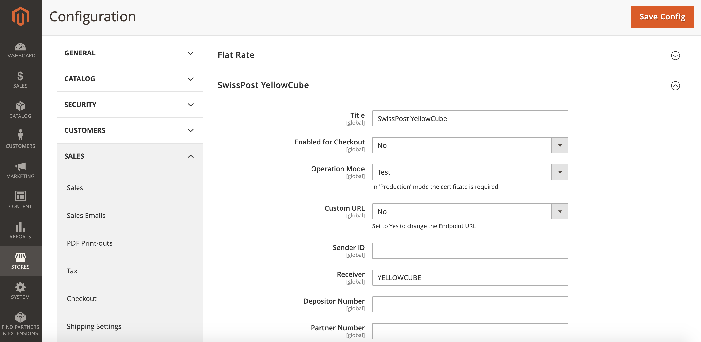

# Configuration

## Basic configuration <a id="basic-configuration"></a>

You will find the YellowCube configuration section under: **Stores** &gt; **Configuration** &gt; **Sales** &gt; **Shipping Methods**.



The fields below **SwissPost YellowCube** need to be setup.

#### Fields obtained from the YellowCube:

* _Sender ID_: The shop ID.
* _Receiver_: The receiver value. The default value is set to `YELLOWCUBE`.
* _Depositor Number_: This number will be assigned to you by Swiss Post.
* _Partner Number_: The unique number in the YellowCube system.
* _Plant-ID_: The storage location.

#### Connection details:

* _Title_: The title of the plugin.
* _Enabled for Checkout_: Whether the extension is enabled in the checkout process or not.
* _Operating mode_**:** Choose between Testing, Production, or Development.
  * In Testing mode orders are processed virtually. Documents, labels etc. are printed out and scanned. This mode is for testing purposes.
  * Production mode needs to be set when the website is live and working.
  * Development mode is only intended to be used by developers. YellowCube users should never use this mode.
* _Custom URL_: Whether to enable the custom endpoint URL.
  * _URL to the Endpoint_: The YellowCube SOAP custom EntryPoint for the selected operating mode.
* _Certificate Path and Filename_: If the certificate authentication is used, provide path to the certificate file on the server in this field \(relative to the folder of the Magento 2 YellowCube extension\). For security reasons, the certificate must be placed outside of the public root directory.
* _Certificate Password_: The password to the certificate if this authentication method is used. For security reasons, it is recommended to protect your certificate with a password.
* _Debug_: This setting will enable logging and it is relevant for development purposes.

#### Shipping information:

* _Shipping Method_: The list of available shipping methods. You can choose one or multiple supported YellowCube shipping methods and define price for each of these shipping methods.
* _Tara Factor_: _Gross Weight_ is required for YellowCube. This can be calculated with Tara Factor: _Gross Weight = Net Weight x Tara Factor._
* _Ship to Applicable Countries_: The list of allowed countries for shipping purposes.
* _Ship to Specific Countries_: Use this list to select the allowed countries for shipping.

Note that you need to provide the IP address of your Magento 2 Shop to YellowCube for giving your shop access to YellowCube. This can also affect the configuration for any staging/development environments. Consult your dedicated service provider for more informations about that.

Every time you save the settings form all states and caches are cleared. Background processes will re-run with the next trigger. This reduces issues when switching between Testing / Production and different accounts. However product registration states remain stale.

_Limitation_: Do NOT connect multiple shop instances to the same YellowCube account as WAR request \(hourly cron containing confirming shippings with track & trace\) can not be shared.

## Synchronisation

On the configuration form, you are able to use the following synchronisation options:

* _Resend Product Data to YellowCube_: Each product in your Magento 2 shop can be enabled for the synchronisation with YellowCube. Clicking this button will send all the relevant information to YellowCube about your products.
* _Get Current Stock Data from YellowCube_: This button will update the stock data for each YellowCube product in your catalog


## Custom Shipping Methods‌ <a id="production-go-live"></a>

The list of known shipping methods can be extend in `app/etc/config.php`. For example:

```php
    'system' => [
        'default' => [
            'carriers' => [
                'yellowcube' => [
                    'methods' => [
                        'eco' => [
                            'label' => 'PostPac Economy CHANGED',
                            'code' => 'ECO',
                        ],
                        'extra' => [
                            'label' => 'Extra new option',
                            'code' => 'ECO EXTRA',
                            'real_code' => 'ECO',
                            'additional' => 'EXTRA',
                        ],
                    ],
                ],
            ],
        ],
    ],
```

Before making configuration changes make sure to export the whole configuration and then adjust it. See [Export the configuration](https://devdocs.magento.com/guides/v2.3/config-guide/cli/config-cli-subcommands-config-mgmt-export.html) for more details.

