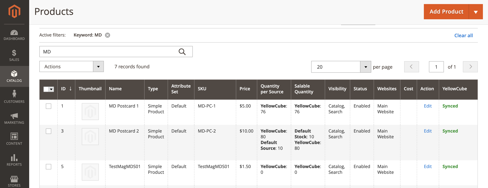
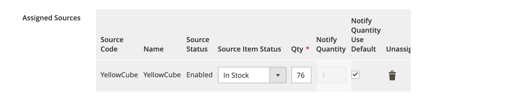
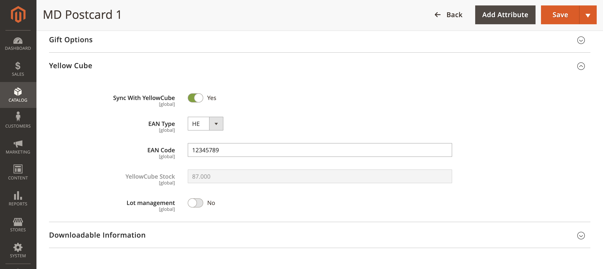

# Products

A product that is managed by YellowCube needs to be registered first.

## Product list 

The registration status of each products can be seen on the product listing page \(**Catalog &gt; Products**\):

The possible values in the YellowCube column are:

* _Not connected_: Product is not connected to YellowCube.
* _Synced_: YellowCube confirmed that it received and processed the product information. Everything seems to be OK.
* _Error_: YellowCube was unable to process the product information. Check the log next to the label to learn more.

_Quantity per Source_ describes the total number of items in the YellowCube stock source. 

_Salable Quantity_ provides the number of items items in the stock that can be used for new orders. `Salable Quantity = YellowCube stock - Pending orders`.

## Edit product details 

In order to register a product at YellowCube successfully it needs to meet the following requirements:

* _SKU_: required field, used as primary product identifier. Changes are not supported after registration at YellowCube.
* _Weight_: in kilograms \(kg\).
* _Dimensions \(length, width, height\)_: in cm, not strictly required. However, it is recommended to provide this information.
* _Assigned sources_: required to add YellowCube source for products managed with YellowCube.

Detailed information about YellowCube communication about the product is available at the bottom of the product edit page.

In order enable product synchronisation with YellowCube you need to enable _Sync with YellowCube_. Click _Save_ to confirm the product changes.

## Advanced: Using EAN 

YellowCube supports _EAN_ \(European Article Numbers\) values with the following options:

* EAN Type
* EAN Code

EAN code typically contains 8 or 13 characters. YellowCube will use them to better identify labelled products.

## Advanced: Lot management 

In order to deal with expiring products, you can enable lot management by choosing _Lot management_ and submitting a product update.

You can't deactivate lot management once it has been enabled. Even after disconnecting the product, it needs manual delete at YellowCube to re-add it without lot management again. Before enabling lot management you need to consider all implications of such action. If you are unsure about that please contact Swiss Post support for more information.

## Disconnect from YellowCube 

A product can be disconnected from YellowCube by disabling the _Sync with YellowCube_ option. The option is visible under Yellow Cube tab at the bottom of the product edit page.

Disconnected products will not be sent to YellowCube as order items if they are part of an order.

If you later reconnect the product again, it will match the previously created product at YellowCube again based on the SKU.

