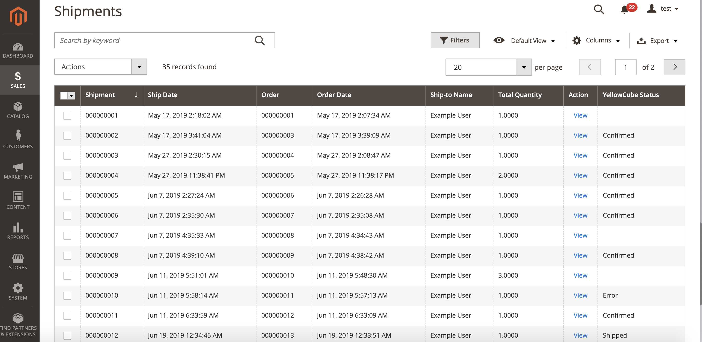

# Shipments

The Shipments overview provides a central place to manage your shipments processed by YellowCube.

When relevant orders are created they will be sent to YellowCube as soon as orders reach the _Processing_ status.

Go to **Sales &gt; Shipments** to access the Shipments overview page.

The possible values in the YellowCube column are:

* _\(Empty\)_: Order has not been sent to YellowCube at all. This could mean that this specific order shouldn't be processed by YellowCube or that there are still conditions to be met to do so \(usually awaiting payment\).
* _Submitted_: Order has been sent to YellowCube but it hasn't been processed on their side yet.
* _Confirmed_: Order was dispatched from the YellowCube facility and the product is on its way to the customer. Tracking code is provided in the logs if applicable.
* _Error_: A problem occurred wile trying to process the order on the YellowCube side. Check the logs on the shipment page for more information.

## Shipment details 

Detailed information about YellowCube communication about each shipment is available at the bottom of the order details page \(**Sales &gt; Orders &gt; View Order &gt; Shipment &gt; View Shipment**\). The same information can be accessed from the Shipments overview page \(**Sales &gt; Shipments &gt; View Shipment**\).

The status of the shipping is displayed on the right side under Shipping and Tracking Information tab just next to Payment Information.

Log of all the communication about the shipment can be seen at the bottom of the page. If there were any problems you will be able to see the error messages here.

## Stock reservation on submission 

Any order submission will reserve its articles and deduct each products stock counter immediately. As a result, the _Salable Quantity_ count is lower than the YellowCube stock count.

## Proper order cancellation 

An order can stay stuck in status _Pending Payment_ if a customer cancels on the payment page. Customers choosing manual payment methods in status _On hold_ might change their mind about the order. 

In order to free the reserved stock on cancellation, the store administrator has to put the order to status _Canceled_.

Permanently deleting an order with reserved stock via trash will not restore the stock counter.

## Stop product delivery 

Once an order is submitted to YellowCube, you can not stop its delivery in YellowCube Magento 2 Extension.

A store administrator can try to stop delivery by [calling YellowCube Support](https://www.post.ch/en/business-solutions/logistics-and-warehousing/yellowcube#contact) as long as the delivery was no yet started.

Additionally, the store administrator will need to manually set the status to _Canceled_ to free its stock again.

## Returns 

Please note that the YellowCube Magento 2 Extension currently doesn't handle order returns automatically. If a return happens the affected order will remain unchanged, the payment refund and any other relevant steps need to be made manually by the store administrator. The stock increase will be visible in the stock table the next day after the return.

## Troubleshoot submission errors 

If the order triggers a submission error, make sure first that all products are properly registered at YellowCube by resubmitting them with the button _Save_ \(product\). Then try submitting the order again.

If a product has never been sent to YellowCube before, it is skipped on order submission and expected to be manually processed. In order to submit such a product to YellowCube, you need to create a new order after product registration.

