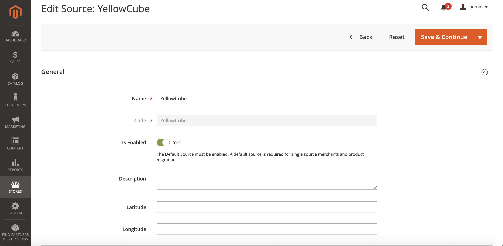
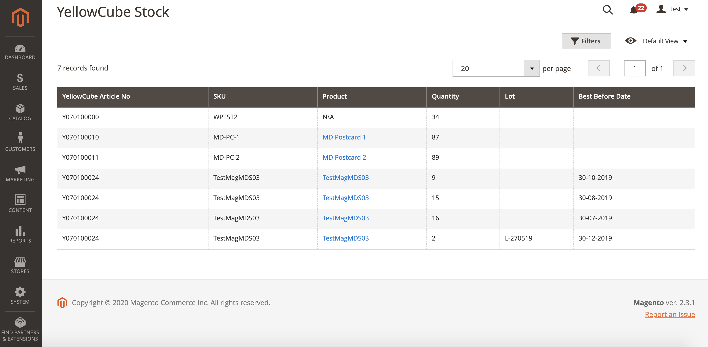

# Stock management

Magento 2 allows you to manage inventory regardless of the warehouse location. There are two steps to have Stock management in place.

## Sources

Sources describe the physical locations where products are managed. Go to **Store &gt; Inventory &gt; Sources** to open the Sources configuration page. 

Upon enabling the extension, the Sources list should already contain YellowCube source.

The YellowCube source must be enabled. 

## Stocks

Stocks is a virtual inventory of your products available for sale through your sales channels.

Similarly to sources, the YellowCube Magento 2 extension creates and configures YellowCube stock entity. Keep in mind that YellowCube stock must have a valid YellowCube source assigned.

##  Reports

YellowCube Magento 2 Extension creates a stock report about available product quantities.

Access the page by navigating to **Reports &gt; Products &gt; YellowCube Stock**.

The table displays a list of YellowCube articles with the following columns:

* _YellowCube Article No_: The remote YellowCube identifier.
* _SKU_: The local SKU.
* _Product_: The referenced product in the Magento 2 shop.
* _Quantity_: The available quantity in the YellowCube stock.
* In case the [lot management is enabled](products.md#advanced-lot-management) for a product the following columns have values:
  * _Lot_: The YellowCube lot identifier.
  * _Best Before Date_: The expiration date.

Use each of the table columns above as filter option. 

The Stock inventory data synchronises with YellowCube on a daily basis. See [Background updates](background-updates.md) for more details.

